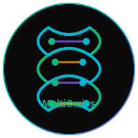

<div align="center">
  
  # 🧬 MultiOmics-Integrator
  # Developed by ANSH SHARMA (NIT Calicut)
  
  ### Deep Learning for Proteomics-Transcriptomics Data Fusion
  
  [](https://nextjs.org/)
  [](https://www.typescriptlang.org/)
  [](https://threejs.org/)
  [](https://www.tensorflow.org/js)
  [](LICENSE)
  
  
  
  **A comprehensive AI-powered platform for integrating proteomics and transcriptomics data**
  
  [🚀 Live Demo](#-live-demo) • [✨ Features](#-features) • [🏗️ Architecture](#️-architecture) • [📊 Datasets](#-datasets) • [🔧 Installation](#-installation)
  
</div>

---

## 📖 Table of Contents

- [🎯 Aim & Objectives](#-aim--objectives)
- [✨ Features](#-features)
- [🏗️ Architecture](#️-architecture)
- [🤖 AI/ML Models](#-aiml-models)
- [📊 Datasets](#-datasets)
- [🔧 Installation](#-installation)
- [🚀 Deployment](#-deployment)
- [📸 Screenshots](#-screenshots)
- [🛠️ Tech Stack](#️-tech-stack)
- [📄 Citation](#-citation)
- [🤝 Contributing](#-contributing)
- [📧 Contact](#-contact)

---

## 🎯 Aim & Objectives

### Aim
To develop an advanced deep learning platform that integrates proteomics and transcriptomics data for comprehensive molecular profiling, enabling researchers to discover post-transcriptional regulatory mechanisms through interactive visualization and analysis.

### Objectives

| Objective | Description |
|-----------|-------------|
| 🔬 **Multi-Modal Integration** | Develop a multi-modal variational autoencoder to jointly learn representations from proteomics and transcriptomics data |
| 🧠 **Cross-Modal Learning** | Implement cross-modal attention mechanisms to capture relationships between mRNA expression and protein abundance levels |
| 📉 **Dimensionality Reduction** | Apply UMAP and t-SNE for visualization of integrated multi-omics landscapes |
| 🔍 **Discordance Analysis** | Create analysis pipelines for identifying discordant mRNA-protein pairs revealing post-transcriptional regulatory mechanisms |
| 🎨 **Interactive Visualization** | Build 3D interactive visualizations of molecular structures, neural network architectures, and analysis results |

---

## ✨ Features

### 🏠 Multi-Page Interface

| Page | Description |
|------|-------------|
| **Home** | Stunning landing page with 3D DNA helix animation and feature overview |
| **Data Upload** | Upload custom datasets or select from curated public datasets |
| **Analysis** | Configure and run AI-powered multi-omics analysis with real-time progress |
| **Neural Architecture** | Interactive 3D visualization of the VAE architecture with animated neurons |
| **Results** | View analysis results with UMAP/t-SNE plots and discordant pair analysis |
| **About** | Learn about methodology, data sources, and developer information |

### 🎨 3D Visualizations

<table>
  <tr>
    <td align="center">
      <b>DNA Double Helix</b><br>
      <i>Animated 3D DNA structure with floating particles</i>
    </td>
    <td align="center">
      <b>Neural Network</b><br>
      <i>Interactive VAE architecture with pulsing neurons</i>
    </td>
    <td align="center">
      <b>Protein Structures</b><br>
      <i>Alpha helices, beta sheets, and active sites</i>
    </td>
  </tr>
</table>

### 🤖 AI/ML Capabilities

- **Multi-Modal Variational Autoencoder (VAE)**
- **Cross-Modal Attention Mechanisms**
- **Canonical Correlation Analysis (CCA) Initialization**
- **UMAP & t-SNE Dimensionality Reduction**
- **Discordant mRNA-Protein Pair Detection**

---

## 🏗️ Architecture

### System Architecture

```
┌─────────────────────────────────────────────────────────────────┐
│                     MultiOmics-Integrator                        │
├─────────────────────────────────────────────────────────────────┤
│                                                                  │
│  ┌──────────────┐    ┌──────────────┐    ┌──────────────┐       │
│  │   Frontend   │    │   Backend    │    │  ML Service  │       │
│  │   (Next.js)  │◄──►│   (API)      │◄──►│  (TensorFlow)│       │
│  └──────────────┘    └──────────────┘    └──────────────┘       │
│         │                   │                    │               │
│         ▼                   ▼                    ▼               │
│  ┌──────────────┐    ┌──────────────┐    ┌──────────────┐       │
│  │  Three.js    │    │   Zustand    │    │  WebSocket   │       │
│  │  3D Engine   │    │   Store      │    │  Real-time   │       │
│  └──────────────┘    └──────────────┘    └──────────────┘       │
│                                                                  │
└─────────────────────────────────────────────────────────────────┘
```

### Neural Network Architecture

```
Input Layer          Encoder           Latent Space         Decoder          Output Layer
┌─────────┐      ┌───────────┐       ┌───────────┐      ┌───────────┐      ┌─────────┐
│ Genes   │      │ Hidden    │       │ Cross-    │      │ Hidden    │      │ Protein │
│ 20,531  │─────►│ Layers    │──────►│ Modal     │─────►│ Layers    │─────►│ 12,753  │
│         │      │ 512→256   │       │ Attention │      │ 256→512   │      │         │
└─────────┘      └───────────┘       └───────────┘      └───────────┘      └─────────┘
                         │                   │                   │
                         ▼                   ▼                   ▼
                   ┌───────────┐       ┌───────────┐      ┌───────────┐
                   │   μ, σ    │       │ Latent    │      │  KL Div   │
                   │ (128-dim) │       │ Vector z  │      │  Loss     │
                   └───────────┘       └───────────┘      └───────────┘
```

---

## 🤖 AI/ML Models

### Multi-Modal Variational Autoencoder

```typescript
// VAE Configuration
const config = {
  inputDimProteomics: 12753,
  inputDimTranscriptomics: 20531,
  latentDim: 128,
  hiddenDims: [512, 256],
  learningRate: 0.001,
  dropoutRate: 0.3,
};
```

### Loss Function

```
L = L_reconstruction + β × L_KL

Where:
- L_reconstruction = MSE(x, x̂)
- L_KL = -0.5 × Σ(1 + log(σ²) - μ² - σ²)
```

### Cross-Modal Attention

```
Attention(Q, K, V) = softmax(QK^T / √d_k) × V

Where:
- Q: Query (transcriptomics features)
- K: Key (proteomics features)
- V: Value (joint representation)
```

---

## 📊 Datasets

### Sample Datasets Included

| Dataset | Source | Genes | Proteins | Samples |
|---------|--------|-------|----------|---------|
| **TCGA Breast Cancer** | [NCI Genomic Data Commons](https://www.cancer.gov/tcga) | 20,531 | 12,753 | 1,098 |
| **CPTAC Ovarian Cancer** | [Clinical Proteomic Tumor Analysis Consortium](https://proteomics.cancer.gov/programs/cptac) | 18,423 | 9,842 | 847 |
| **Human Protein Atlas** | [Knockout Mouse Project](https://www.proteinatlas.org) | 19,613 | 15,000 | 5,000 |

### Data Sources

| Source | URL | Description |
|--------|-----|-------------|
| TCGA | https://www.cancer.gov/tcga | Comprehensive molecular characterization of cancer |
| CPTAC | https://proteomics.cancer.gov/programs/cptac | Proteogenomic characterization of cancer |
| GTEx | https://gtexportal.org | Tissue-specific gene expression |
| UniProt | https://www.uniprot.org | Protein sequence and function database |
| Human Protein Atlas | https://www.proteinatlas.org | Tissue and cell-specific protein expression |

---

## 🔧 Installation

### Prerequisites

- Node.js 18+
- Bun or npm
- Git

### Quick Start

```bash
# Clone the repository
git clone https://github.com/anshsharmacse/multiomics-integrator.git

# Navigate to project directory
cd multiomics-integrator

# Install dependencies
bun install

# Run development server
bun run dev

# Open http://localhost:3000 in your browser
```

### Environment Variables

Create a `.env.local` file:

```env
# Optional: Add any API keys if needed
# OPENAI_API_KEY=your_key_here
```

### Database Setup (Optional)

```bash
# Push Prisma schema to database
bun run db:push

# Generate Prisma client
bun run db:generate
```

---

## 🚀 Deployment

### Deploy to Vercel

[](https://vercel.com/new/clone?repository-url=https://github.com/anshsharmacse/multiomics-integrator)

#### Steps:

1. **Fork or Clone** this repository
2. **Connect** to Vercel:
   ```bash
   npm i -g vercel
   vercel login
   vercel
   ```
3. **Set Environment Variables** in Vercel dashboard (if any)
4. **Deploy!** Your app will be live in seconds

### Manual Deployment

```bash
# Build the project
bun run build

# Start production server
bun run start
```

---

## 📸 Screenshots

### Home Page
> Beautiful landing page with 3D DNA helix animation

### Data Upload
> Upload interface with sample dataset selection

### Analysis Dashboard
> Real-time training visualization with progress metrics

### Neural Architecture
> Interactive 3D neural network visualization

### Results
> UMAP/t-SNE plots and discordant pair analysis

### About Page
> Methodology, data sources, and developer information

---

## 🛠️ Tech Stack

### Frontend

| Technology | Purpose |
|------------|---------|
| [Next.js 16](https://nextjs.org/) | React framework with App Router |
| [TypeScript 5](https://www.typescriptlang.org/) | Type-safe JavaScript |
| [Tailwind CSS 4](https://tailwindcss.com/) | Utility-first CSS |
| [shadcn/ui](https://ui.shadcn.com/) | Beautiful UI components |
| [Three.js](https://threejs.org/) | 3D graphics |
| [React Three Fiber](https://docs.pmnd.rs/react-three-fiber) | React renderer for Three.js |
| [Framer Motion](https://www.framer.com/motion/) | Animations |

### Backend & ML

| Technology | Purpose |
|------------|---------|
| [TensorFlow.js](https://www.tensorflow.org/js) | Machine learning in browser |
| [Socket.io](https://socket.io/) | Real-time communication |
| [Zustand](https://zustand-demo.pmnd.rs/) | State management |
| [Prisma](https://www.prisma.io/) | Database ORM |

### Tools

| Tool | Purpose |
|------|---------|
| [Bun](https://bun.sh/) | JavaScript runtime & package manager |
| [ESLint](https://eslint.org/) | Code linting |
| [Lucide Icons](https://lucide.dev/) | Beautiful icons |

---

## 📄 Citation

If you use this project in your research, please cite:

```bibtex
@software{sharma2026multiomics,
  author = {Ansh Sharma},
  title = {MultiOmics-Integrator: Deep Learning for Proteomics-Transcriptomics Data Fusion},
  year = {2026},
  publisher = {GitHub},
  url = {https://github.com/anshsharmacse/multiomics-integrator}
}
```

**APA Format:**
```
Ansh Sharma (2026). MultiOmics-Integrator: Deep Learning for
Proteomics-Transcriptomics Data Fusion. GitHub Repository.
https://github.com/anshsharmacse/multiomics-integrator
```

---

## 🤝 Contributing

Contributions are welcome! Please feel free to submit a Pull Request.

1. **Fork** the repository
2. **Create** your feature branch (`git checkout -b feature/AmazingFeature`)
3. **Commit** your changes (`git commit -m 'Add some AmazingFeature'`)
4. **Push** to the branch (`git push origin feature/AmazingFeature`)
5. **Open** a Pull Request

### Code of Conduct

- Be respectful and inclusive
- Welcome newcomers
- Accept constructive criticism
- Focus on what is best for the community

---

## 📧 Contact

<div align="center">

### **Ansh Sharma**

[](https://github.com/anshsharmacse)
[](https://www.linkedin.com/in/anshsharmacse/)
[](mailto:anshsharmacse@gmail.com)

</div>

---

## 📜 License

This project is licensed under the MIT License - see the [LICENSE](LICENSE) file for details.

---

<div align="center">

### ⭐ Star this repository if you found it helpful!

**Made with ❤️ by [Ansh Sharma](https://github.com/anshsharmacse)**


</div>
